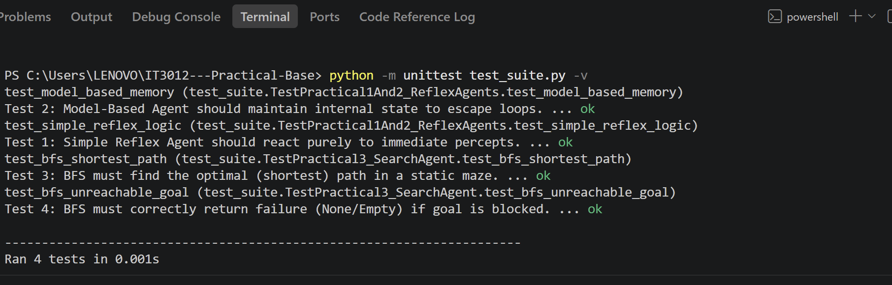
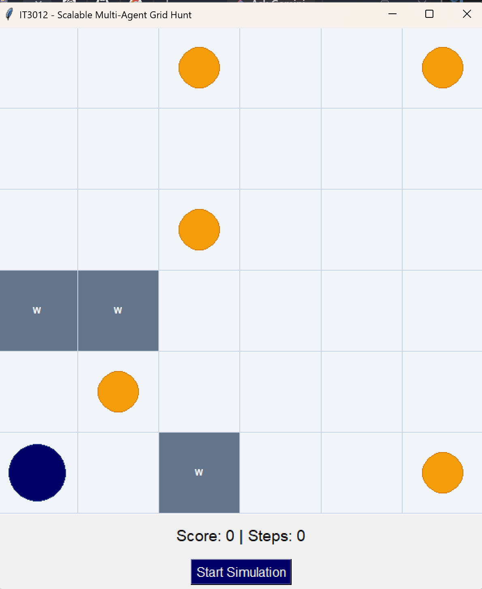
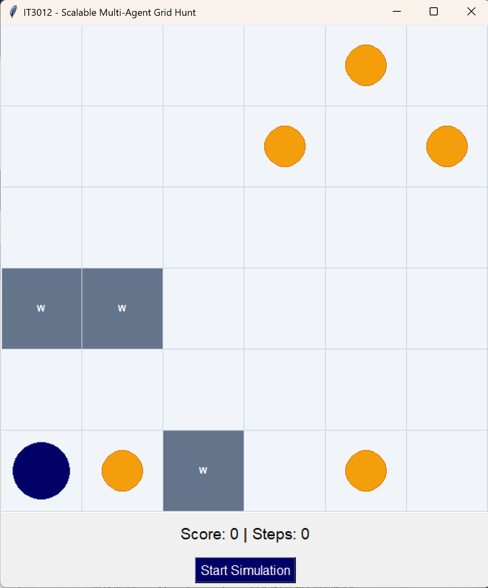
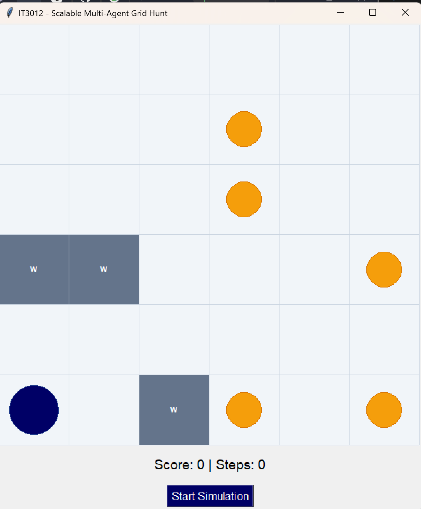

# IT3012---Practical-Base Code

# Intelligent Agents

## Practical 03 - Search Agent

This practical implements a goal-based agent using:

- Breadth-First Search (BFS)
- Depth-First Search (DFS)
- Uniform-Cost Search (UCS)

The agent uses the grid size, walls, current position, and food positions to create an offline plan before moving.

## Test Results

All four unit tests passed successfully.

## BFS Result

BFS explores nearby states first and finds the shortest path because every movement costs 1.

## DFS Result

DFS explores one branch deeply. Therefore, it may produce a longer and winding path.

## UCS Result

UCS selects the path with the lowest total cost. Since every movement costs 1, its result is normally similar to BFS.

## Files

- `agent.py` - Contains BFS, DFS, UCS, and agent implementations.
- `visual_grid_game.py` - Contains the visual grid environment.
- `test_suite.py` - Contains the unit tests.
- `IT24103717_Lab03.pdf` - Practical documentation.

## Student Details

- Registration number: IT24103717
- Module: IT3012 - Intelligent Agents
- Practical: Practical 03