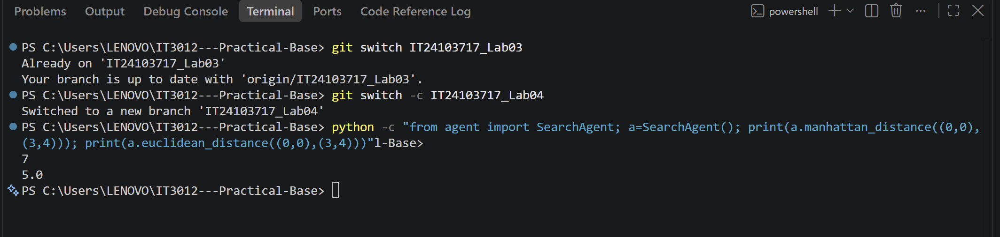
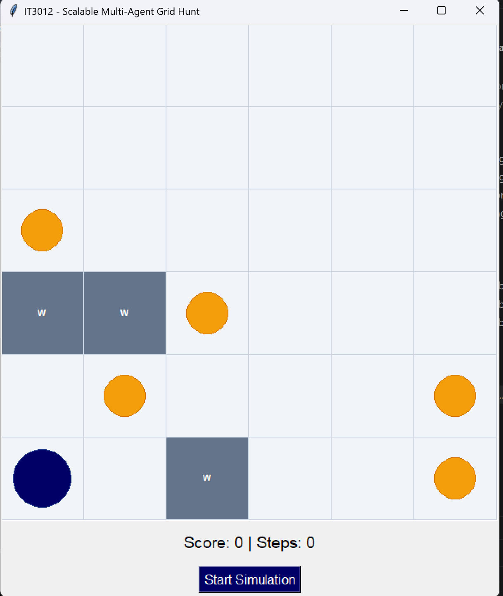

# IT3012 - Practical Base Code

# Intelligent Agents

## Practical 03 - Search Agent

This practical implements a goal-based agent using:

* Breadth-First Search (BFS)
* Depth-First Search (DFS)
* Uniform-Cost Search (UCS)

The agent uses the grid size, walls, current position and food positions to create an offline plan before moving.

## Test Results

All four unit tests passed successfully.


## BFS Result

BFS explores nearby states first and finds the shortest path because every movement costs 1.


## DFS Result

DFS explores one branch deeply. Therefore, it may produce a longer and winding path.


## UCS Result

UCS selects the path with the lowest total cost. Since every movement costs 1, its result is normally similar to BFS.


## Practical 03 Files

* `agent.py` - Contains BFS, DFS, UCS and agent implementations.
* `visual_grid_game.py` - Contains the visual grid environment.
* `test_suite.py` - Contains the unit tests.
* `IT24103717Lab3.pdf` - Practical 03 documentation.

## Practical 03 Student Details

* Registration Number: IT24103717
* Module: IT3012 - Intelligent Agents
* Practical: Practical 03

---

## Practical 04 - A* Informed Search Agent

Practical 04 extends the goal-based `SearchAgent` by implementing A* Search with heuristic functions.

The following features were implemented:

* Manhattan Distance heuristic
* Euclidean Distance heuristic
* A* Search using a priority queue
* Closest-food goal selection
* Integration of A* into the agent's decision loop
* Integration of the A* agent with the visual grid environment

## Heuristic Test Results

The heuristic functions were tested using the start position `(0, 0)` and the goal position `(3, 4)`.

The results were:

* Manhattan Distance: `7`
* Euclidean Distance: `5.0`



## A* Search Implementation

A* Search prioritizes nodes using the following evaluation function:

```text
f(n) = g(n) + h(n)
```

Where:

* `g(n)` is the actual path cost from the start to the current node.
* `h(n)` is the estimated cost from the current node to the goal.
* `f(n)` is the estimated total cost through the current node.

The A* priority queue stores each node in the following format:

```text
(f_cost, g_cost, current_position, path_taken)
```

Manhattan Distance is used as the default heuristic because the environment permits four-way movement: Up, Down, Left and Right.

## A* Grid Result

The visual environment was configured to use the `SearchAgent` with A* as the active algorithm:

```python
self.agent = SearchAgent()
self.agent.active_algo = 'AStar'
```

The agent uses A* to navigate around walls and move toward the closest remaining food item.



## Practical 04 Files

* `agent.py` - Contains Manhattan Distance, Euclidean Distance and A* Search.
* `visual_grid_game.py` - Contains the visual environment configured to use A*.
* `test_suite.py` - Contains the unit tests.
* `IT24103717Lab4.pdf` - Practical 04 documentation.
* `screenshots/heuristic-results.png` - Heuristic test evidence.
* `screenshots/astar-grid-result.png` - A* simulation evidence.

## Practical 04 Student Details

* Registration Number: IT24103717
* Module: IT3012 - Intelligent Agents
* Practical: Practical 04
* Faculty: Faculty of Computing
